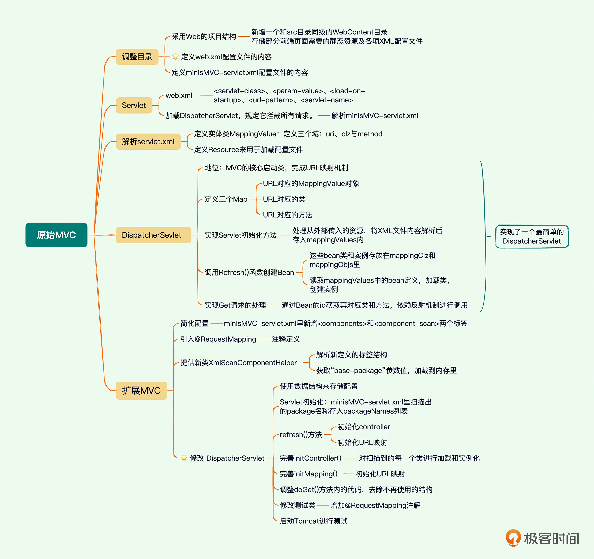

# Minis

## 手把手带你写一个MiniSpring

### 07｜原始MVC：如何通过单一的Servlet拦截请求分派任务？

在了解Maven之前，我们先来看看一个Java项目需要的东西。首先，我们需要确定引入哪些依赖包。例如，如果我们需要用到commons logging，我们就必须把commons logging的jar包放入classpath。如果我们还需要log4j，就需要把log4j相关的jar包都放到classpath中。这些就是依赖包的管理。

其次，我们要确定项目的目录结构。例如，src目录存放Java源码，resources目录存放配置文件，bin目录存放编译生成的.class文件。

此外，我们还需要配置环境，例如JDK的版本，编译打包的流程，当前代码的版本号。

最后，除了使用Eclipse这样的IDE进行编译外，我们还必须能通过命令行工具进行编译，才能够让项目在一个独立的服务器上编译、测试、部署。

这些工作难度不大，但是非常琐碎且耗时。如果每一个项目都自己搞一套配置，肯定会一团糟。我们需要的是一个标准化的Java项目管理和构建工具。

Maven就是是专门为Java项目打造的管理和构建工具，它的主要功能有：

提供了一套标准化的项目结构；
提供了一套标准化的构建流程（编译，测试，打包，发布……）；
提供了一套依赖管理机制。
Maven项目结构
一个使用Maven管理的普通的Java项目，它的目录结构默认如下：

a-maven-project
├── pom.xml
├── src
│   ├── main
│   │   ├── java
│   │   └── resources
│   └── test
│       ├── java
│       └── resources
└── target
项目的根目录a-maven-project是项目名，它有一个项目描述文件pom.xml，存放Java源码的目录是src/main/java，存放资源文件的目录是src/main/resources，存放测试源码的目录是src/test/java，存放测试资源的目录是src/test/resources，最后，所有编译、打包生成的文件都放在target目录里。这些就是一个Maven项目的标准目录结构。

所有的目录结构都是约定好的标准结构，我们千万不要随意修改目录结构。使用标准结构不需要做任何配置，Maven就可以正常使用。

